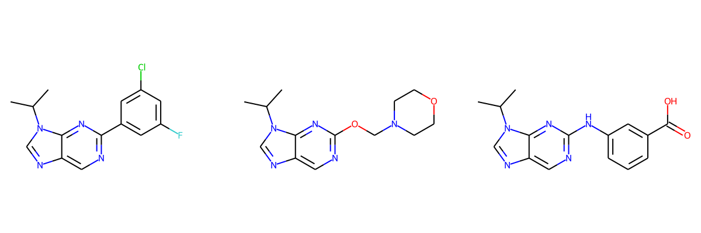

# Molecular Reinforcement Learning
> Unlocking reinforcement learning for drug design


MRL is an open source python library designed to unlock the potential of drug design with reinforcement learning. 

MRL bridges the gap between generative models and practical drug discovery by enabling fine-tuned control over chemical spaces. Control what structures are generated and where they occur.

MRL is suitable for all stages of drug discovery, from high diversity hit expansion screens to hyper-focused lead optimization



## Use Cases

MRL can be applied to:
- [Small molecules](https://darkmatterai.github.io/mrl/tutorials.html#Small-Molecules)
- [Proteins](https://darkmatterai.github.io/mrl/tutorials.html#Proteins)
- [Polymers](https://darkmatterai.github.io/mrl/tutorials.html#Polymers)
- [DNA](https://darkmatterai.github.io/mrl/tutorials.html#DNA)
- Catalysts (coming soon)

View our [tutorials](https://darkmatterai.github.io/mrl/tutorials.html) for more examples

## Install

__NOTE__: MRL is currently under active development. Currently it is recommended to install the most up-to-date version using the `Developer Install` instructions below

### Without Installing

MRL can be used without installing via [Google Collab](https://colab.research.google.com/notebooks/intro.ipynb). Open any page in the [documentation](https://darkmatterai.github.io/mrl/) and click the "Open in Collab" button to open the notebook in Google Collab. Make sure to change the runtime to GPU.

### Anaconda

MRL is available via Anaconda.

```
conda create -n mrl python=3.7
conda install -c dmai -c rdkit -c pytorch -c fastai -c conda-forge mrl
```

### PyPi

MRL is available via pypi. First [install pytorch](https://pytorch.org/get-started/locally/). Then run the following:

```
pip install mrl-pypi
```

### Developer Install 

If you plan to develop the library or want the most up to date release, use an editable install. First [install pytorch](https://pytorch.org/get-started/locally/). Then run the following:

```
git clone https://github.com/DarkMatterAI/mrl
pip install -e .
```

## How to use

Here's an example of using a MRL pre-trained model to generate compounds based on the [ChEMBL](https://www.ebi.ac.uk/chembl/) library:

```python
from mrl.model_zoo import LSTM_LM_Small_Chembl

agent = LSTM_LM_Small_Chembl()

preds, log_probs = agent.model.sample_no_grad(512, 90)
smiles = agent.reconstruct(preds)

smiles[:10]
>['COC(=O)C1=C(Nc2ccc(Br)cc2)SCC1=O',
 'Cc1nnc2n1CN(C(C)=O)CC2c1ccc2c(c1)OCO2',
 'COc1ccc(C(=O)NNc2c(C#N)cnn2-c2ccccc2)c(OC)c1',
 'COC(=O)C1(C)C=C(N2CC2)C(=O)C(C(C)=O)=C1',
 'CC(O)(c1cccc(Cl)c1)c1nc(-c2cccc(-n3cncn3)c2)co1',
 'Clc1cccc2ccc(-n3c(-c4ccccc4)nc4ccccc4c3=O)nc12',
 'Cc1cccc(NC(=O)CSc2nnnn2-c2ccc3c(c2)OCCO3)c1',
 'Nc1n[nH]c(=O)c2cc(NCc3ccc(C(=O)O)c(Cl)c3)ccc12',
 'CCOc1ccc(NC(=O)c2oc3ccccc3c2NC(=O)c2ccccc2OC)cc1',
 'Cc1ccc2c(N3CCN(CC(=O)Nc4ccc(N5CCCCC5=O)cc4)CC3)cccc2n1']
```

## Getting Started

See the MRL [documentation page](https://darkmatterai.github.io/mrl/) for full documentaion

See the MRL [tutorials page](https://darkmatterai.github.io/mrl/tutorials.html) for examples

## Contributing

MRL uses [nbdev](https://github.com/fastai/nbdev) for development. This allows us to build code, tests and documentation at the same time.

To contribute, install [nbdev](https://github.com/fastai/nbdev). Then run `nbdev_install_git_hooks` in your terminal. This sets up git hooks, which clean up the notebooks to remove the extraneous stuff stored in the notebooks which causes unnecessary merge conflicts.

If you make changes to a notebook, run `nbdev_build_lib` to update the library.

If you make changes to the library, run `nbdev_update_lib` to update the notebooks.

Submit PRs to the `dev` branch.

Before submitting a PR, run `nbdev_diff_nbs` to verify the notebooks and the library match.

## Acknowledgements

MRl is built using many open source libraries. We would especially like to thank the development teams behind [Pytorch](https://github.com/pytorch/pytorch), [RDKit](https://github.com/rdkit/rdkit) and [fastai](https://github.com/fastai)

## Roadmap

New Modules:
- Huggingface/transformers integration
- Chemprop integration
- Docking integration
- Pharmacophore

New modalities:
- Catalysts

Tutorials:
- In depth, multi-cycle affinity optimization
- Generative screening primer
